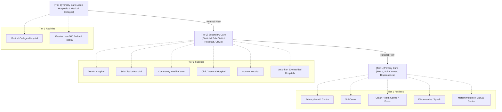

# Government Healthcare Facilities Hierarchy

This document outlines the hierarchy and classification of public healthcare facilities in India as defined by the Indian Public Health Standards (IPHS), mapped directly to the actual dataset and tier_level logic used in the ArogyaMitra database.

Understanding this hierarchy is critical for filtering nearby facilities and routing patients to the appropriate level of care based on the severity of their needs.

## Hierarchy Tree Diagram

---

## [Tier 1] Primary Healthcare (1_primary)
*The first point of contact for the community with the medical officer/health system. Focuses on maternal and child health, immunization, basic first aid, and minor ailments.*

The following facility types from our database fall under Tier 1:
- **SubCentre:** The most peripheral contact point, manned by Auxiliary Nurse Midwives (ANMs) and Health Workers.
- **Primary Health Centre (PHC):** The first contact point between a village community and a Medical Officer. Acts as a referral unit for Sub-Centres.
- **Urban Health Centre / Urban Health Posts:** Similar to PHCs but located in urban areas and slums.
- **Dispensaries / Ayush Dispensaries:** Basic outpatient facilities providing essential allopathic or AYUSH medicines and basic consultations.
- **M&CW Center:** Maternity & Child Welfare Centers focusing on basic reproductive and infant health.
- **Maternity Home:** Basic maternal care facilities for normal deliveries.

> **Use Case for App:** Route users here for vaccinations, basic fever/colds, prenatal checkups, and minor injuries.

---

## [Tier 2] Secondary Healthcare (2_secondary)
*Serves as the first referral unit (FRU) for primary healthcare facilities. Provides specialist care (surgery, medicine, obstetrics, gynecology, and pediatrics).*

The following facility types from our database fall under Tier 2:
- **Community Health Center (CHC):** Manned by specialist doctors and acts as a referral center for PHCs. Equipped with indoor beds, X-ray, and labor rooms.
- **Sub-District Hospital:** Located at the block/taluka level, providing specialist services bridging the gap between CHCs and District Hospitals.
- **District Hospital:** The apex hospital at the district level providing comprehensive secondary healthcare services and intensive care.
- **Civil Hospital/General Hospital:** Large secondary care units often functioning similarly to District Hospitals.
- **<100 Bedded Hospital / 100-500 Bedded Hospital:** Classified by bed capacity, indicating a secondary care capability.
- **Women Hospital:** Specialized secondary care focusing exclusively on maternal health, high-risk pregnancies, and neonatal care.
- **Referral Hospital:** Intermediate hospitals serving as referral points for specific regions.
- **Post Partum Unit:** Units attached to hospitals focusing on maternal and infant care immediately following childbirth.

> **Use Case for App:** Route users here for emergencies, complicated deliveries, surgeries, severe trauma, and cases requiring inpatient admission (beds).

---

## [Tier 3] Tertiary Healthcare (3_tertiary)
*Highly specialized care, teaching institutions, and apex bodies. Handles complex surgeries, advanced diagnostics, and critical care.*

The following facility types from our database fall under Tier 3:
- **Medical Colleges Hospital:** Attached to government medical universities. Provides advanced multidisciplinary care (e.g., neurology, cardiology, oncology) and teaching facilities.
- **>500 Bedded Hospital:** Massive infrastructure hospitals generally indicative of tertiary care levels.

> **Use Case for App:** Route users here *only* for highly specialized treatments (cancer, neurosurgery, advanced cardiology) or when referred by a secondary hospital. Do not recommend for basic first-aid to avoid overcrowding.

---

## Specialized / Unclassified (4_specialized / unknown)
*Facilities that do not neatly fit into the standard public health tiers or lack sufficient metadata.*

- **Others:** Temporary camps, specialized mobile medical units, or administrative health offices that do not provide standard clinical care pathways.

---

## Implementation in ArogyaMitra API

When querying the /api/v1/govt-healthcare-facilities/nearby endpoint, the tier_level parameter can be used to filter results:
- ?tier_level=1_primary
- ?tier_level=2_secondary
- ?tier_level=3_tertiary
- ?tier_level=all (Default)

This categorization allows the ArogyaMitra AI Chatbot to intelligently recommend a nearby SubCentre or PHC for a simple fever, but immediately escalate to recommending a District Hospital for a suspected fracture or severe medical emergency.
